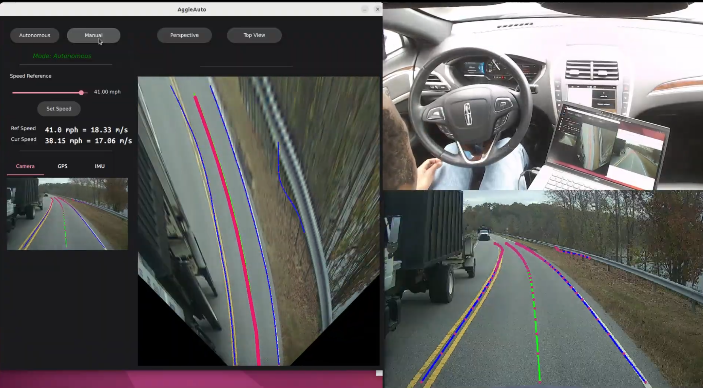

## Realtime Semantic Segmentation-Based Lane Detection
Recent lane detection methods based on deep learning outperform conventional image-processing approaches but are often computationally intensive and difficult to deploy in real time. This paper proposes a lightweight lane detection method that combines simplified semantic segmentation with a novel clustering technique to identify lane boundaries. The segmentation network is iteratively reduced in complexity to minimize memory usage and inference time while maintaining detection accuracy. The resulting segmentation features are clustered and fitted with cubic splines to represent lane boundaries. On the TuSimple dataset, the proposed method achieves performance comparable to state-of-the-art approaches. Deployment on a real autonomous vehicle platform achieves over 92 FPS, demonstrating its suitability for real-time autonomous driving.

> Full paper available on  <a href="https://ieeexplore.ieee.org/document/11711274">IEEE Xplore</a>
### Demo Videos

  Practical Test using Lincoln-MKZ vehicle for lane following
   - <a href="https://youtu.be/4uAIHSv2nFw?si=DpbNWx7U-t39IYB9"> 4.5 km test drive </a>
  <a href="https://youtu.be/4uAIHSv2nFw">
    
  </a>

  <hr>
  
  Test on a video by our self-driving car platform - Lincoln MKZ
  
   - <a href="https://youtu.be/i6n5FwmtrMs?si=4Fd8-LgZfSEATNZp"> Rural road driving - Brown Summit - NC </a>


## Block-diagram
 

## Experimental Results
Lane Detection results for some challenging scenarios
 

## Pre-Trained Models
 The pre-trained model is available in the ```models/``` folder and includes the following:
  - A PyTorch model saved with epochs, state dictionary, and optimizer state dictionary
  - A serialized and optimized model for inference using ```toch.jit.script()```
  - The model in ONNX format
    
### Testing the serialized model
We tested the serialized model in Ubuntu 22.04 with a conda environment created as follows:
```Shell
# Create conda environment:
conda create -n test_env python==3.10

#Activate the environment
conda activate test_env

# Install pytorch. If gpu is available in your system.
conda install pytorch==2.1.1 torchvision==0.16.1 torchaudio==2.1.1 pytorch-cuda=12.1 -c pytorch -c nvidia
# if your system doesn't have gpu, conda install pytorch==2.1.1 torchvision==0.16.1 torchaudio==2.1.1 cpuonly -c pytorch

#Install opencv:
pip install opencv-python

# Clone this repo:
git clone https://github.com/ACCESSLab/Lane-Detection-using-Segmentation
cd Lane-Detection-using-Segmentation

# Run the Python script:
python test_model.py

# Test on Jetson Orin Nano Super if available.
python jetson_test.py

```
You can modify the <code> config.py </code> to 
- change prediction threshold
- provide test image path/directory
- provide a path to save the inference results
- change target device (cuda or cpu)

<hr>

### Citation
```bibtex
@article{11711274,
  author    = {Getahun, Tesfamichael and Karimoddini, Ali},
  journal   = {IEEE Transactions on Intelligent Vehicles},
  title     = {Real-time Semantic Segmentation-based Lane Detection for Automated Driving},
  year      = {2026},
  volume    = {},
  number    = {},
  pages     = {1-11},
  doi       = {10.1109/TIV.2026.3737152},
  url       = {[https://ieee.org](https://ieeexplore.ieee.org/document/11711274)}
}
```


